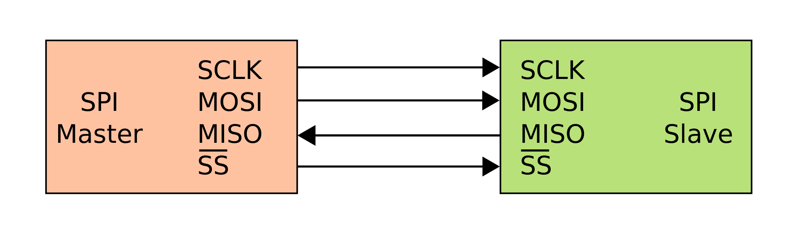

# Basic SPI

## Introduction

| spi mode | CPOL | CPHA | Clock polarity | Phase                                               |
| -------- | ---- | ---- | -------------- | --------------------------------------------------- |
| 0        | 0    | 0    | idles at 0     | trailing edge(neg) shift, leading edge(pos) capture |
| 1        | 0    | 1    | idles at 0     | leading edge(pos) shift, trailing edge(neg) capture |
| 2        | 1    | 0    | idles at 1     | trailing edge(pos) shift, leading edge(neg) capture |
| 3        | 1    | 1    | idles at 1     | leading edge(neg) shift, trailing edge(pos) capture |

## spi_master

### I/O

| Port name              | I/O    | Descirption                             |
| ---------------------- | ------ | --------------------------------------- |
| clk                    | input  | system clock                            |
| rst_n                  | input  | system reset                            |
| master_din[WIDTH-1:0]  | input  | data sent by master                     |
| spi_start              | input  | transmission start pluse                |
| miso                   | input  | master input slave output               |
| mode[1:0]              | input  | spi mode                                |
| sclk                   | output | spi clock                               |
| cs_n                   | output | chip select(negative enable)            |
| mosi                   | output | master output slave input               |
| spi_rdy                | output | transmission finished(data ready pluse) |
| master_dout[WIDTH-1:0] | output | data received from slave                |

### FSM

DIV_N		-->		clk divide factor

WIDTH		-->		data width

| STATE  | INIT        | PRE             | TRAN                    | FINISH                   |
| ------ | ----------- | --------------- | ----------------------- | ------------------------ |
| INIT   | ①!rst_n    | ①!rst_n        | ①!rst_n                | ①!rst_n/②de_cnt==DIV_N |
| PRE    | ②spi_start |                 |                         |                          |
| TRAN   |             | ②de_cnt==DIV_N |                         |                          |
| FINISH |             |                 | ②tr_cnt==WIDTH*DIV_N-1 |                          |

## spi_slave

### I/O

| Port name             | I/O    | Description                             |
| --------------------- | ------ | --------------------------------------- |
| clk                   | input  | system clock                            |
| rst_n                 | input  | system reset                            |
| sclk                  | input  | spi clock                               |
| cs_n                  | input  | chip select(negative enable)            |
| mode[1:0]             | input  | spi mode                                |
| slave_din[WIDTH-1:0]  | input  | data sent by slave                      |
| mosi                  | input  | master output slave input               |
| miso                  | output | master input slave output               |
| slave_dout[WIDTH-1:0] | output | data received from master               |
| slave_out_rdy         | output | transmission finished(data ready pluse) |

### FSM	

| STATE | INIT     | TRAN                 | READY       |
| ----- | -------- | -------------------- | ----------- |
| INIT  | ①!rst_n | ①!rst_n             | ①!rst_n/② |
| TRAN  | ②cs_neg |                      |             |
| READY |          | ②shift_cnt==WIDTH-1 |             |
